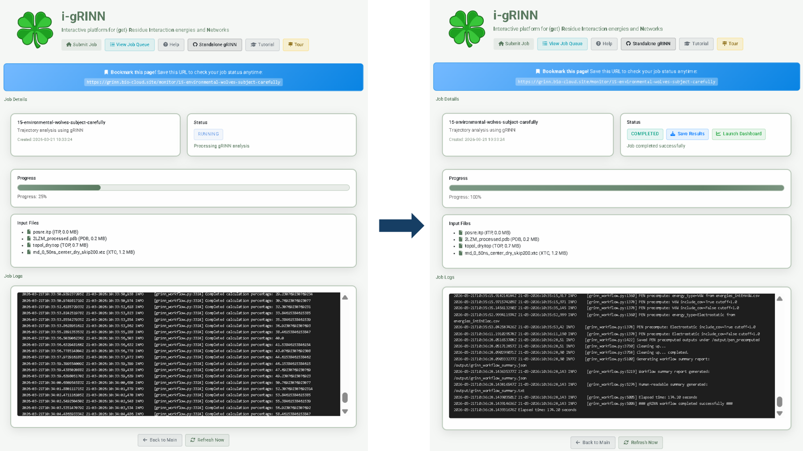
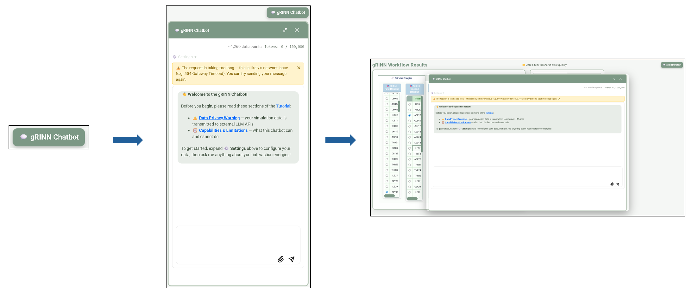
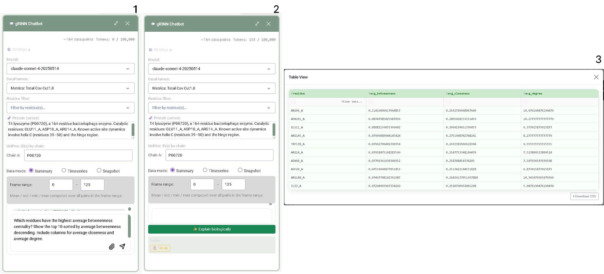
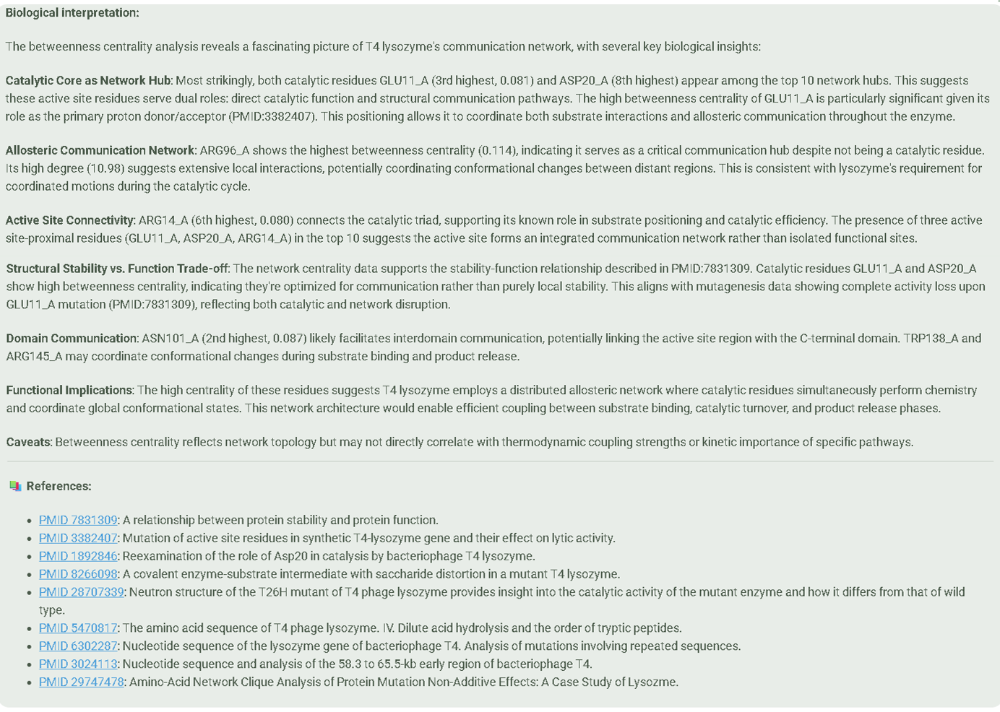
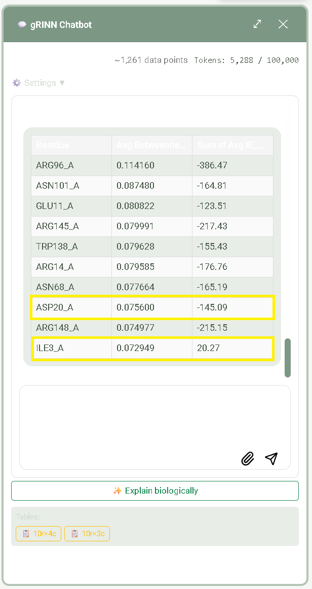
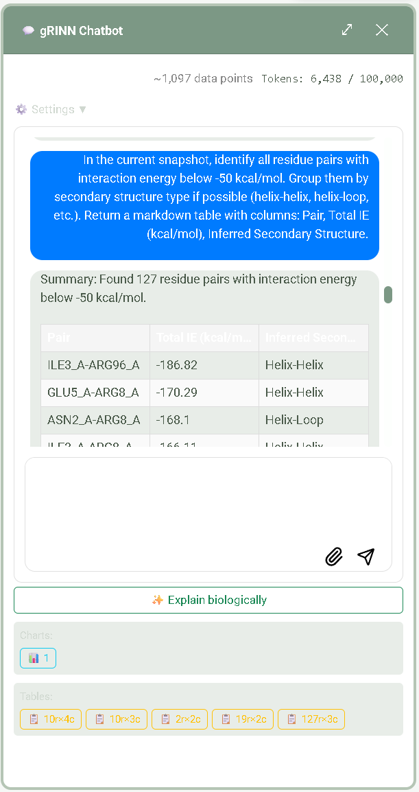
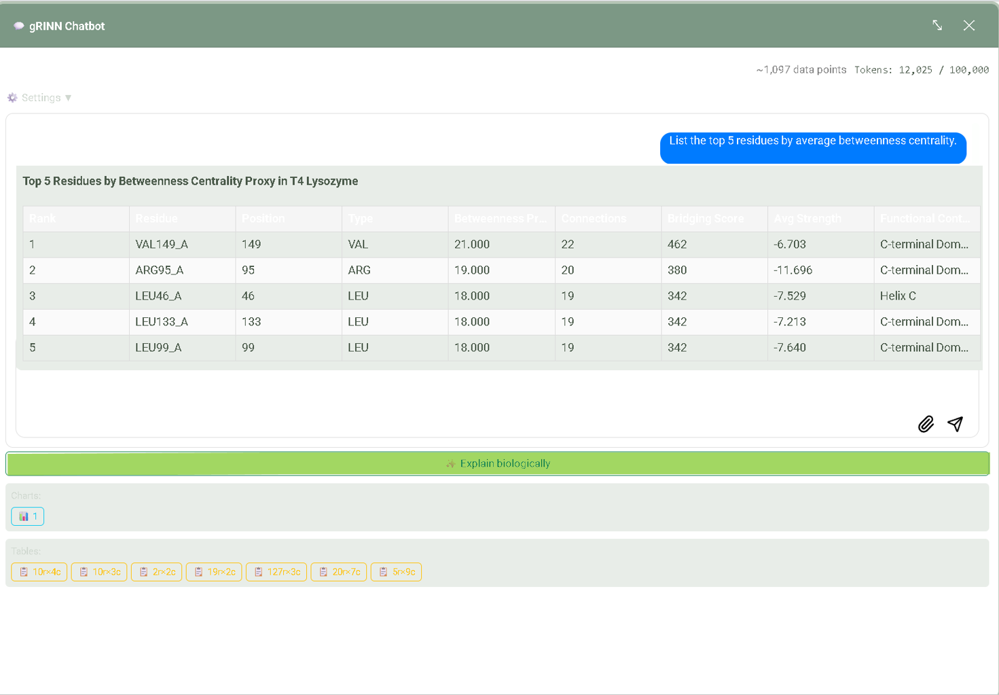
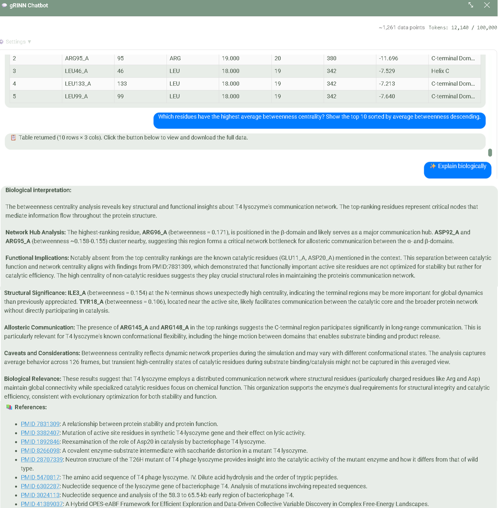

# i-gRINN Web Service Tutorial

This tutorial guides you through the full i-gRINN web service workflow — from submitting a molecular dynamics analysis job to visualizing results and using the AI-powered chatbot for biological interpretation. Part I covers the web interface; Part II covers the gRINN Chatbot panel that opens from within the results dashboard.

## Table of Contents

### Part I — Web Interface
- [1. Submitting a Job](#1-submitting-a-job)
  - [1.1 Choose Your Analysis Mode](#11-choose-your-analysis-mode)
  - [1.2 Upload Input Files](#12-upload-input-files)
  - [1.3 Advanced Parameters](#13-advanced-parameters)
  - [1.4 Submit the Job](#14-submit-the-job)
- [2. Monitoring Your Job](#2-monitoring-your-job)
  - [2.1 Progress Bar and Job Logs](#21-progress-bar-and-job-logs)
  - [2.2 Output Files Reference](#22-output-files-reference)
- [3. Job Queue](#3-job-queue)
  - [3.1 Job Status Overview](#31-job-status-overview)
  - [3.2 Private Jobs and Data Retention](#32-private-jobs-and-data-retention)
- [4. Viewing Results](#4-viewing-results)
  - [4.1 Pairwise Interaction Energy](#41-pairwise-interaction-energy)
  - [4.2 Interaction Energy Matrix](#42-interaction-energy-matrix)
  - [4.3 Protein Energy Network](#43-protein-energy-network)
    - [4.3.1 Network Metrics](#431-network-metrics)
    - [4.3.2 Shortest Path Analysis](#432-shortest-path-analysis)

### Part II — gRINN Chatbot
- [A. Introduction to the gRINN Chatbot](#a-introduction-to-the-grinn-chatbot)
  - [A.1 What It Is and Where It Fits](#a1-what-it-is-and-where-it-fits)
  - [A.2 Data Privacy Warning](#a2-data-privacy-warning)
  - [A.3 Capabilities and Limitations](#a3-capabilities-and-limitations)
- [B. Opening and Navigating the Chatbot Panel](#b-opening-and-navigating-the-chatbot-panel)
  - [B.1 Opening the Panel](#b1-opening-the-panel)
  - [B.2 Closing the Panel](#b2-closing-the-panel)
  - [B.3 Expanding to a Floating Overlay](#b3-expanding-to-a-floating-overlay)
  - [B.4 Dragging and Resizing](#b4-dragging-and-resizing)
- [C. The Settings Panel](#c-the-settings-panel)
  - [C.1 Global Settings](#c1-global-settings)
  - [C.2 Data Mode and Mode-Specific Controls](#c2-data-mode-and-mode-specific-controls)
  - [C.3 Session and Persistence Behaviour](#c3-session-and-persistence-behaviour)
- [D. Guided Walkthrough: From Network Hubs to Biological Insight](#d-guided-walkthrough-from-network-hubs-to-biological-insight)
  - [D.1 Setup: Configuring the Chatbot for P00720](#d1-setup-configuring-the-chatbot-for-p00720)
  - [D.2 First Prompt: Identify Network Hubs by Betweenness Centrality](#d2-first-prompt-identify-network-hubs-by-betweenness-centrality)
  - [D.3 ✨ Explain Biologically — Connecting Hubs to Function](#d3--explain-biologically--connecting-hubs-to-function)
  - [D.4 Follow-Up: Energy–Centrality Cross-Reference (Optional)](#d4-follow-up-energycentrality-cross-reference-optional)
- [E. Analysis Examples by Data Mode](#e-analysis-examples-by-data-mode)
  - [E.1 Summary Mode — Global Statistical Overview](#e1-summary-mode--global-statistical-overview)
  - [E.2 Timeseries Mode — Temporal Evolution](#e2-timeseries-mode--temporal-evolution)
  - [E.3 Snapshot Mode — Single-Frame Investigation](#e3-snapshot-mode--single-frame-investigation)
  - [E.4 Example Prompt Ideas by Analytical Goal](#e4-example-prompt-ideas-by-analytical-goal)
- [F. Biological Interpretation Feature](#f-biological-interpretation-feature)
  - [F.1 How it works (two-stage pipeline)](#f1-how-it-works-two-stage-pipeline)
  - [F.2 When to use it](#f2-when-to-use-it)
  - [F.3 Understanding the output and references](#f3-understanding-the-output-and-references)
  - [F.4 Model requirements](#f4-model-requirements)
- [G. Token Usage and Session Management](#g-token-usage-and-session-management)
  - [G.1 Token counter display and color coding](#g1-token-counter-display-and-color-coding)
  - [G.2 Token budget](#g2-token-budget)
  - [G.3 What happens at budget exhaustion](#g3-what-happens-at-budget-exhaustion)
  - [G.4 Session caching behavior](#g4-session-caching-behavior)
- [H. Tips, Best Practices, and Troubleshooting](#h-tips-best-practices-and-troubleshooting)
  - [H.1 Choosing the right data mode (decision table)](#h1-choosing-the-right-data-mode-decision-table)
  - [H.2 Improving response quality](#h2-improving-response-quality)
  - [H.3 Stride and data size management](#h3-stride-and-data-size-management)
  - [H.4 Common errors and troubleshooting](#h4-common-errors-and-troubleshooting)
  - [H.5 Limitations summary](#h5-limitations-summary)

---

## Part I — Web Interface

### 1. Submitting a Job

i-gRINN Web Service is free to use and requires no account or login. Simply open the application in your browser and you can submit a job immediately.

---

#### 1.1 Choose Your Analysis Mode

The Submit Job page is the entry point for all analyses. Two analysis modes are available depending on the type of data you have: **Trajectory Analysis** and **PDB Ensemble** mode. Select the mode that matches your input files using the **Analysis Mode** radio buttons at the top of the page.

**Trajectory Analysis**

Trajectory mode is designed for standard molecular dynamics simulations. It requires three input files that together describe your system's structure, dynamics, and bonded interactions.

| File | Format | Description |
|------|--------|-------------|
| Structure | .pdb or .gro | Protein structure file |
| Trajectory | .xtc or .trr (max 100 MB) | MD trajectory file |
| Topology | .top | GROMACS topology file |

> [!WARNING]
> If your .top file uses `#include` directives for additional files, upload those files too — missing includes will cause job failures.

If your simulation used a custom force field, you can upload the force field directory as a .zip archive. The .zip should contain the force field directory at its top level (e.g., `myff.ff/`), and the server will make it available to GROMACS during topology processing.

> [!NOTE]
> Atom numbers in your structure (.pdb/.gro) and topology files must match. Mismatches between the two are one of the most common causes of job failures.

---

**PDB Ensemble Mode**

Ensemble mode accepts a single multi-model PDB file, such as an NMR ensemble or a set of docked poses. Topology is generated automatically using GROMACS `pdb2gmx`, so no topology file is required. When this mode is selected, a force field selector appears allowing you to choose the force field that `pdb2gmx` will use for topology generation.

> [!WARNING]
> Non-standard residues (small molecules, cofactors, modified amino acids) are not supported in Ensemble mode. The automatic topology generation via `pdb2gmx` can only handle standard protein residues.

---

#### 1.2 Upload Input Files
<p align="center">
  
</p>

> **Figure 1:** The Submit Job page. Navigation bar at top; Analysis Mode radio buttons; file upload area with size-limit labels; Load Example Data button; GROMACS version dropdown.

Files can be added by dragging and dropping them onto the upload area, or by clicking inside the area to open a file browser. To get started quickly without your own data, click the **Load Trajectory Example Data** button to pre-load the Endolysin dataset — a small, fully configured trajectory job ready to submit immediately.

| File Type | Limit |
|-----------|-------|
| Trajectory (.xtc/.trr) | 100 MB |
| Structure / Topology | 10 MB |
| Maximum frames/models | 200 |

Once files are uploaded, they appear in a list below the upload area. The server automatically detects the purpose of each file (structure, trajectory, or topology) based on its extension and assigns it the appropriate role. If you upload two files of the same type — for example, two .pdb files — a dropdown will appear for that file slot so you can select which file should be used. To remove a file from the list, click the trash bin icon next to its entry.

---

#### 1.3 Advanced Parameters
<p align="center">
  
</p>

> **Figure 2:** Advanced Parameters collapsible panel expanded, showing parameter inputs and the Submit Job button with public/private toggle below.

An **Advanced Parameters** collapsible panel is available below the file upload section. Expanding it is entirely optional — the default values are sensible for most jobs and you can submit without changing anything here. These parameters give you finer control over which frames are analyzed and which residue pairs are included.

| Parameter | Default | Description |
|-----------|---------|-------------|
| Skip Frames | 1 | Analyze every N-th frame (1 = analyze all frames) |
| Initial Pair Filter Cutoff (Å) | 12 | Maximum center-of-mass distance between residue pairs for inclusion in analysis |
| Source Selection | — | ProDy atom selection syntax to define source residues, e.g. `protein and resid 1:100` |
| Target Selection | — | ProDy atom selection syntax to define target residues, e.g. `protein and resid 101:200` |

> [!WARNING]
> Excluding large portions of the system via Source/Target selections will break downstream Protein Energy Network analyses — network weights for excluded residues will be missing. Use these selections only when you have a specific reason to restrict the analysis, and be aware of the downstream consequences.

---

#### 1.4 Submit the Job

The **Submit Job** button becomes active only once all required files have been uploaded and validated by the server. If a required file is missing or a file fails validation, the button remains disabled and an error message indicates what needs to be corrected.

Jobs are **private by default**, meaning they will not appear in the shared Job Queue visible to other users. If you would like your job to be visible to others — for example, to share progress with a collaborator — check the **Make job public (visible in Job Queue)** checkbox below the submit button before submitting.

After the job is submitted, a confirmation banner appears on the page displaying the assigned Job ID and a direct link to the job monitoring page.

> [!TIP]
> Bookmark the monitoring URL immediately — it is the only way to return to a private job's results. Private jobs are not listed anywhere in the interface; the monitoring URL is the sole access point for your results.

### 2. Monitoring Your Job

After submitting a job, the browser automatically redirects to the **Job Detail** page for that job. You can return to this page at any time by bookmarking the URL — it remains accessible for as long as the job record exists.

---

#### 2.1 Progress Bar and Job Logs
<p align="center">
  
</p>

> **Figure 3:** Job Detail page shown in two states: left panel shows job running at ~25% progress; right panel shows the same job completed at 100% with Save Results and Launch Dashboard buttons visible.

The Job Detail page displays all the information you need to track your job from submission to completion. At the top, the **Job ID** is shown alongside the creation timestamp in Turkey Standard Time (UTC+3). A color-coded status badge reflects the current state of the job — **RUNNING**, **COMPLETED**, or **FAILED** — and updates automatically as the job progresses. Below the status information, the list of uploaded input files is shown for reference. The **progress bar** tracks overall pipeline advancement, and the **Job Logs** panel below it streams the live output of the running workflow.

The progress bar advances most noticeably during the interaction energy calculation stage, which is the most computationally intensive part of the pipeline. Earlier stages complete quickly by comparison, so the bar may appear to stall briefly before accelerating through the final stages.

**Workflow Stages**

Each job progresses through seven sequential stages, reflected in the Job Logs panel:

1. GROMACS environment setup
2. Input validation
3. Trajectory processing
4. Initial pair filtering
5. Interaction energy calculation
6. Result generation
7. PEN precomputation

> [!NOTE]
> Each job runs inside an isolated Docker container. The seven stages above reflect the full analysis pipeline; the progress bar advances as each stage completes.

**On Completion**

Once the job reaches **COMPLETED** status, two action buttons appear:

| Button | Action |
|--------|--------|
| **Save Results** | Download all result files as a `.zip` archive |
| **Launch Dashboard** | Open the interactive visualization dashboard for this job |

---

#### 2.2 Output Files Reference

The result archive downloaded via **Save Results** contains the following files.

**Energy Data Files**

| File | Contents |
|------|----------|
| `average_interaction_energies.csv` | Time-averaged total, vdW, and electrostatic energies for each residue pair, including chain and residue metadata |
| `energies_intEnTotal.csv` | Per-frame total (vdW + electrostatic) pairwise interaction energies in kcal/mol; wide format with rows as residue pairs and columns as trajectory frames |
| `energies_intEnVdW.csv` | Per-frame van der Waals pairwise interaction energies (kcal/mol) |
| `energies_intEnElec.csv` | Per-frame electrostatic pairwise interaction energies (kcal/mol) |
| `energies_*.pickle` | Serialized Python dictionaries containing the raw energy data, intended for fast dashboard loading and direct programmatic access |

**Network Data**

The `pen_precomputed/` subdirectory contains precomputed Protein Energy Network (PEN) data used by the **Network Analysis** tab of the dashboard. It includes a `manifest.json` describing the PEN parameters, a `nodes.csv` with residue node mappings, per-frame centrality metric files (`metrics_*.csv`), and per-frame edge files (`edges_*.csv`) encoding network connectivity, weights, and distances.

**Structure & Log Files**

| File | Contents |
|------|----------|
| `system_dry.pdb` | Processed protein structure with solvent and ions removed, used as the reference structure throughout the analysis |
| `topol_dry.top` | GROMACS topology file (either as provided or auto-generated from the input structure) |
| `traj_dry.xtc` | Processed trajectory with any frame-skipping applied as specified at submission time |
| `calc.log` | Full workflow log with timestamps and debug information covering all pipeline stages |
| `gromacs.log` | GROMACS command output and messages generated during structure and trajectory processing |

### 3. Job Queue

The **Job Queue** page, accessible from the navigation bar at the top of every page, provides a live overview of all publicly visible jobs across all users of the service. It is the primary place to monitor ongoing analyses and to revisit completed results without knowing a specific Job ID in advance.

---

#### 3.1 Job Status Overview
<p align="center">
  
</p>

> **Figure 4:** Job Queue page showing a table of jobs with status badges (RUNNING, COMPLETED, EXPIRED), Job IDs, creation times, and filter controls at the top.

The queue page displays all public jobs in a sortable table. At the top of the page, two filter controls let you narrow the list: a text input for matching a **Job ID** substring, and a dropdown to filter by **status**. The table refreshes automatically every 10 seconds, so status changes appear without requiring a manual page reload.

Each row shows the Job ID (which doubles as a link to the monitoring page), the job's creation timestamp, and a coloured status badge. The possible statuses are:

| Status | Meaning |
|--------|---------|
| **RUNNING** | Job is currently being processed by a worker |
| **COMPLETED** | Job finished successfully — results and the interactive dashboard are available |
| **EXPIRED** | Result files have been permanently deleted; the job record remains visible for reference |

---

#### 3.2 Private Jobs and Data Retention

By default, all jobs submitted through i-gRINN Web are **private**. Private jobs do not appear in the Job Queue and are not visible to any other user browsing the service. If another user navigates directly to the monitoring URL of a private job, they will see only a placeholder entry labelled **"Private job"** with no further details exposed.

Because private jobs are invisible in the queue, the only way to return to a private job later is through its **direct monitoring URL** — the unique link shown immediately after submission. You should bookmark this URL or save it securely as soon as the job is submitted; there is no account-based mechanism to recover it afterward.

**Data Retention Policy**

- Job result files are retained for **72 hours (3 days)** after the job completes.
- After expiration, all result files are permanently deleted from the server. The job record continues to appear in the queue (status: **EXPIRED**) for a further **7 days**, after which the record itself is also removed.
- All timestamps displayed throughout the service are in **Turkey Standard Time (UTC+3)**.

> [!TIP]
> Download your results before the 72-hour window closes. Once a job has expired, neither the result files nor the interactive dashboard are recoverable from the server.

### 4. Viewing Results

Click **Launch Dashboard** from the Job Detail page to open the interactive visualization interface. The dashboard has three tabs — **Pairwise Energies**, **Interaction Energy Matrix**, and **Network Analysis** — with a shared 3D Viewer and Frame Slider on the right side that stay synchronized across all tabs. Each tab presents a different lens on the same underlying interaction energy data: the Pairwise Energies tab lets you drill into any specific residue–residue pair over the full trajectory; the Interaction Energy Matrix gives you a bird's-eye heatmap of all pairwise averages at once; and the Network Analysis tab exposes residue centrality metrics derived from the Protein Energy Network. The sections below walk through the first two tabs in detail.

---

#### 4.1 Pairwise Interaction Energy
<p align="center">
  
</p>
> **Figure 5:**  Pairwise Energies tab showing the full layout: residue selection lists on the left, three stacked time-series plots (Total, vdW, Electrostatic) in the center, and the 3D Viewer panel on the right.

<p align="center">
  
</p>

> **Figure 6:** Pairwise Energies tab with a residue pair selected. Red diamond marker on the time-series plots indicates the current frame. The 3D Viewer shows the selected residues highlighted in green.

The **Pairwise Energies** tab is the primary tool for examining how two specific residues interact across the trajectory. Once you select a residue pair from the two scrollable lists on the left, the three stacked time-series plots in the center panel update immediately to show the Total, Van der Waals (vdW), and Electrostatic energy components frame by frame. The 3D Viewer on the right simultaneously highlights the selected pair so you can verify their spatial relationship in the structure.

**Energy Components**

| Component | Physical Meaning |
|-----------|-----------------|
| Van der Waals (vdW) | Lennard-Jones potential — short-range dispersion and steric effects |
| Electrostatic | Coulombic interactions — long-range charge contributions |
| Total | Sum of vdW + Electrostatic (kcal/mol) |

> [!NOTE]
> Negative values indicate attractive interactions; positive values indicate repulsive interactions.

Residues are labeled using the convention `ResidueNameResidueNumber_ChainID`. For example, `GLY30_A` refers to Glycine at position 30 on chain A. This labeling matches the column headers in the raw CSV output files, making it straightforward to cross-reference dashboard selections with the underlying data.

**Step 1:** Select a residue pair by clicking one residue in the left list and one in the right list. Both lists are searchable — type part of a residue name or number to filter the entries. The three time-series plots and the 3D Viewer update automatically as soon as both selections are made.

**Step 2:** Inspect the three stacked time-series plots (Total / vdW / Electrostatic). The red diamond marker indicates the frame currently loaded in the 3D Viewer. As you read the plots, look for: consistently negative values throughout the trajectory (a stable, attractive interaction); large frame-to-frame fluctuations (a dynamic or transient contact); or a situation where one component dominates while the other stays near zero (for example, a purely electrostatic salt bridge, where the Electrostatic curve is strongly negative but the vdW curve is flat).

**Step 3:** Explore the 3D Viewer on the right. The selected residue pair is highlighted in green against the rest of the protein structure, allowing you to visually confirm their proximity and orientation. Two sub-tabs are available beneath the viewer: **Structure Viewer** renders the molecular representation, while **Network Visualization** overlays the Protein Energy Network graph onto the structure. Use left-click and drag to rotate the structure, scroll the mouse wheel to zoom in or out, and middle-click and drag to pan.

**Step 4:** Navigate through the trajectory using the **Frame Slider** below the 3D Viewer. Dragging the slider forward or backward moves through the trajectory one frame at a time: the 3D structure updates to reflect the atomic positions at the selected frame, and the red diamond on each of the three time-series plots moves synchronously so you can always see which frame you are inspecting.

---

#### 4.2 Interaction Energy Matrix
<p align="center">
  
</p>

> **Figure 7:** Interaction Energy Matrix tab showing the full heatmap with color scale bar. Blue cells indicate attractive interactions; red cells indicate repulsive interactions. The energy type radio buttons (Total / Elec / VdW) are visible above the heatmap.

The **Interaction Energy Matrix** tab provides a global overview of all pairwise average interaction energies as a color-coded heatmap, making it easy to identify energetic hotspots across the entire protein. Each cell in the matrix represents the average interaction energy between one residue pair over the selected trajectory frames: the row and column indices are residue labels, and the cell color encodes the sign and magnitude of that average energy according to the color scale shown alongside the heatmap.

**Step 1:** Switch the energy type using the radio buttons above the heatmap: **Total** | **Elec** | **VdW**. The heatmap re-renders immediately to reflect your choice.

| View | What it highlights |
|------|-------------------|
| Total | Combined picture — recommended starting point for an unbiased overview |
| Elec | Long-range charge interactions; reveals salt bridges and polar contacts between charged or polar residues |
| VdW | Short-range packing; highlights hydrophobic core contacts and close steric complementarity |

**Step 2:** Interpret the color scale. The scale bar on the right edge of the heatmap maps colors to energy values in kcal/mol.

| Color | Value | Meaning |
|-------|-------|---------|
| Deep blue | Strongly negative | Strong attractive interaction |
| Light blue | Weakly negative | Mild attraction |
| White | ≈ 0 | Negligible interaction |
| Red | Positive | Repulsive interaction |

**Step 3:** Interact with the heatmap to focus your analysis. Use the zoom and pan controls in the plot toolbar to enlarge a region of interest — for example, a stretch of the sequence known to contain an active site or binding interface. Click any cell in the heatmap to select that residue pair: the 3D Viewer immediately highlights both residues in green, and the **Pairwise Energies** tab updates its time-series plots for the selected pair so you can examine its full temporal behavior. The matrix title displays the current frame number and updates as you move the Frame Slider, letting you track how the energy landscape shifts across the trajectory.

> [!TIP]
> Off-diagonal clusters of deep blue cells are energetic hotspots — likely hydrophobic core contacts, salt bridges, or catalytic site interactions. Click a hotspot cell to select that pair, then switch to the **Pairwise Energies** tab to examine its time series in detail and assess whether the interaction is stable throughout the simulation or fluctuates between attractive and repulsive states.

For LLM-assisted interpretation of these energies, see **Part II — gRINN Chatbot**.

#### 4.3 Protein Energy Network

A Protein Energy Network (PEN) represents the protein as a graph where residues are nodes and energetically significant interactions are edges. Edge weights are normalized average interaction energies (range [0, 1], attractive interactions favored). Edge distances equal 1 − weight, so shortest-path algorithms prefer stronger interactions — a shorter path distance corresponds to a more energetically favorable communication route through the network.
<p align="center">
  
</p>

> **Figure 8:** Network Analysis tab with the Metrics sub-tab selected. Controls panel on the left shows energy type selector, edge cutoff slider, covalent bonds toggle, and Update Network button. The main area shows metric visualization plots.

The controls panel on the left side of the Network Analysis tab governs how the PEN is constructed. The **Covalent Bonds** toggle determines whether backbone connectivity is included as edges alongside non-covalent interactions. The **Energy Type** selector switches the network between **Total** (combined electrostatic and van der Waals), **Elec** (electrostatic only), and **VdW** (van der Waals only) interaction energies. The **Edge Addition Energy Cutoff** slider sets the minimum interaction energy magnitude (in kcal/mol) that an edge must exceed to be included in the graph — raising this value produces a sparser, higher-confidence network. After adjusting any of these settings, click **Update Network** to recompute the graph before examining metrics or paths.

> [!NOTE]
> Click **Update Network** after changing the cutoff, energy type, or covalent bond setting to recompute the graph. Metric values and shortest paths displayed in the sub-tabs always reflect the most recently built network.

---

##### 4.3.1 Network Metrics

The Metrics sub-tab computes and visualizes graph-theoretic properties of the PEN to identify functionally important residues. Each metric captures a different aspect of a residue's structural or communicative role within the network.

**Step 1:** Select a network metric from the dropdown menu at the top of the Metrics sub-tab. Each metric highlights a different class of important residue.

| Metric | Identifies |
|--------|-----------|
| Degree Centrality | Structural hubs — residues with the most connections |
| Betweenness Centrality | Communication bridges — residues on the most shortest paths |
| Closeness Centrality | Globally central residues for efficient information transfer |

> [!TIP]
> Start with Degree Centrality for an initial structural overview of the network's hub architecture. Switch to Betweenness Centrality to identify potential allosteric communication bridges — residues whose removal would most disrupt long-range signaling across the protein.

**Step 2:** Choose a visualization type to determine how the metric values are displayed in the main panel.

| Type | Best For |
|------|----------|
| Heatmap | Temporal analysis — how metric values change across trajectory frames |
| Violin | Distribution insights — spread and median values across the trajectory |

The **Heatmap** layout maps residues along one axis and trajectory frames along the other, making it straightforward to detect residues whose centrality fluctuates with conformational change. The **Violin** layout collapses the temporal dimension into a distribution summary, which is useful for identifying residues that consistently rank high across the entire trajectory.

**Step 3:** Refine the residue display using the sorting, filtering, and range controls. Use the **Sort** dropdown to order residues by **Sequence Order**, **Ascending** metric value, or **Descending** metric value — select **Descending** to surface the highest-ranking residues at the top of the visualization. Use the **Filter Residues** autocomplete field to focus on a specific subset of residues by name or number. Use the **Min–Max range sliders** to narrow the display to a particular window of metric values or trajectory frames, reducing visual clutter when working with large systems.

**Step 4:** Adjust the network threshold using the **Edge Addition Energy Cutoff** slider to control the stringency of edge inclusion, then click **Update Network** to rebuild the graph. The cutoff you choose directly affects which residues appear as hubs or bridges.

| Edge Cutoff (kcal/mol) | Effect |
|------------------------|--------|
| Lower (e.g., 0.5) | Denser network — more edges included, revealing weaker but potentially relevant contacts |
| Default (1.0) | Balanced — captures significant interactions without overloading the graph |
| Higher (e.g., 3.0) | Sparse — only the strongest interactions retained, highlighting the network backbone |

**Step 5:** Visualize the network in three dimensions by switching to the **3D Viewer** sub-tab and setting the display mode to **Network Visualization**. The PEN is overlaid directly on the protein structure, with edges rendered according to their weights. Use the **Frame Slider** to step through trajectory frames and observe how the network topology — edge presence, hub identity, and connectivity patterns — evolves across the simulation.

---

##### 4.3.2 Shortest Path Analysis

This panel identifies the most efficient communication route between two selected residues through the PEN using Dijkstra's algorithm on edge distances (= 1 − weight). Because edge distances are inversely related to interaction strength, a shorter cumulative path distance indicates a more direct and energetically favorable communication channel between the two residues. This analysis is particularly valuable for mapping allosteric communication routes and identifying residues that relay signals between distant sites.

**Step 1:** Configure the path settings using the controls panel before selecting residues. The choices made here determine which version of the network the path search runs on.

| Setting | Option | Effect |
|---------|--------|--------|
| Covalent bonds | Enabled | Includes backbone connectivity — produces more continuous, physically connected paths |
| Covalent bonds | Disabled | Only non-covalent interactions — highlights allosteric routes independent of sequence proximity |
| Energy type | Total | Combined network — recommended starting point for an unbiased survey |
| Energy type | Elec | Electrostatic-driven communication paths — relevant for charged or polar binding sites |
| Energy type | VdW | Hydrophobic core / packing routes — useful for buried allosteric channels |

**Step 2:** Select the source and target residues using the two autocomplete dropdowns labeled **Source Residue** and **Target Residue**. Type a residue name or number to filter the list and then click the desired entry. The source and target define the endpoints of the communication route; any residue in the system can serve as either endpoint.

**Step 3:** Click **Find Shortest Paths**. The algorithm searches the PEN for the most energetically favorable routes between the source and target and presents the results in a ranked table. Candidate paths are ordered by total path length (distance), with the most favorable route listed first.

| Column | Meaning |
|--------|---------|
| Path | Ordered list of residues forming the communication route from source to target |
| Length (Distance) | Weighted path length — lower values indicate a more energetically favorable route |
| Hops | Number of intermediate residue steps between the source and target |

As a concrete example using the T4 lysozyme / endolysin example dataset, a representative shortest path might read: `MET1_A → ARG8_A → LEU15_A → ASP23_A → GLU31_A`. Each arrow represents a single edge — an energetically significant pairwise interaction — and the path as a whole defines a plausible allosteric communication channel through the protein.

**Step 4:** Click any row in the path table to highlight that path in the 3D Viewer, rendering the participating residues and connecting edges directly on the protein structure. Use the **Frame Slider** to step through trajectory frames and check whether the highlighted path remains stable across the simulation, shifts to a different route at certain conformational states, or breaks entirely during specific structural transitions — all of which constitute direct, frame-level evidence of dynamic allostery.

> [!TIP]
> Frame-by-frame path analysis lets you directly correlate allosteric communication routes with specific conformational states captured in the MD trajectory. A path that appears only in a subset of frames may indicate an allosteric switch that is activated by a transient conformational event.

For deeper biological interpretation of hub residues and communication paths identified here, proceed to **Part II — gRINN Chatbot**, beginning with Section D (Guided Walkthrough).

---

## Part II — gRINN Chatbot

## A. Introduction to the gRINN Chatbot

### A.1 What It Is and Where It Fits

The gRINN Chatbot is accessible from within the results dashboard. If you have not yet submitted a job and launched the dashboard, see **Part I** of this tutorial first.

The **gRINN Chatbot** is an AI assistant embedded directly in the gRINN Dashboard. It allows you to interrogate your **interaction energy** (IE) analysis results using plain English, without writing a single line of code. Instead of manually filtering DataFrames or constructing custom plots, you type a question and the chatbot generates, executes, and returns the answer — as text, a table, or a chart.

The chatbot fits at the end of the standard gRINN workflow:

1. Submit your job (trajectory or ensemble mode)
2. Wait for analysis to complete
3. Click **Launch Dashboard** on the Job Monitor page
4. Inside the dashboard, open the **gRINN Chatbot** panel on the right side of the screen

Under the hood the chatbot uses [PandasAI](https://github.com/sinaptik-ai/pandas-ai) with [LiteLLM](https://github.com/BerriAI/litellm) to translate your question into Python/pandas code, executes that code against slices of your gRINN result DataFrames, and returns the output. Depending on what data you have loaded and what settings you configure, it can send time-series slices, per-frame snapshots, or summary statistics of IE matrices to the configured LLM API.

The chatbot supports two distinct query types:

1. **Natural language queries** — you type a question in the chat input box and receive a text answer, a formatted table, or a Matplotlib chart embedded directly in the conversation.
2. **"✨ Explain biologically" pipeline** — after any chatbot response, a `✨ Explain biologically` button appears. Clicking it sends a summary of the last result, along with any UniProt annotations and PubMed-retrieved literature context you have configured, to the LLM for a scientifically grounded biological interpretation.

<p align="center">
  
</p>

> **Figure A.1:** The gRINN Dashboard with the chatbot panel open.


---

### A.2 Data Privacy Warning

> [!WARNING]
> **Your simulation data is sent to an external server.**
>
> Every time you submit a query, the gRINN Chatbot transmits a slice of your **residue interaction energy data** — and optionally protein annotations such as UniProt accessions and free-text context you have typed — to an external large language model (LLM) API. Depending on your deployment's configuration, this API may be OpenAI, Anthropic (Claude), or Google (Gemini).
>
> This means **your molecular dynamics simulation data leaves the local server** and is processed by a third-party commercial service under that service's own privacy and data-retention policies.
>
> **Do not use the chatbot if:**
> - Your research data is confidential, under embargo, or subject to an institutional or contractual data protection requirement.
> - Your simulation describes unpublished drug candidates, proprietary protein sequences, or sensitive patient-derived structures.
> - You are unsure whether your organisation's data-handling policy permits transmission to external AI APIs.
>
> If you are uncertain about how your specific deployment handles data, contact your system administrator before using the chatbot.

---

### A.3 Capabilities and Limitations

> [!WARNING]
> **The chatbot is a helpful assistant, not an authoritative analysis tool. Verify all results.**
>
> - **Limited data scope.** The chatbot can only analyze the DataFrames you pass to it (up to four at a time). It does not have access to the full simulation trajectory, the raw GROMACS energy files, or any data not present in the loaded result CSVs.
> - **LLM-generated code may contain errors.** Responses are produced by a large language model and are subject to hallucination. Numerical claims, table rankings, and chart annotations may be incorrect. Always cross-check quantitative results against the raw data tables in the Dashboard tabs.
> - **No job control.** The chatbot cannot submit new jobs, modify analysis parameters, re-run calculations, or access external databases directly. UniProt and PubMed lookups occur only as part of the `✨ Explain biologically` pipeline, and only when you have entered UniProt accession IDs in the Settings panel.
> - **Execution time limit.** LLM-generated code runs inside the dashboard container. Complex or long-running computations will time out after 120 seconds and return an error.
> - **Token budget.** Each dashboard session has a configurable token budget. When the budget is exhausted, further queries are blocked until you refresh the page to start a new session.

---

## B. Opening and Navigating the Chatbot Panel

### B.1 Opening the Panel

Locate the `💬 gRINN Chatbot` button in the Dashboard header bar — it sits on the right side of the header, next to the results folder label. Click it once to slide the chatbot panel open on the right side of the screen.

When the panel opens, the dashboard's main content area automatically reflows: the analysis tab panel narrows and the molecular viewer panel shrinks to make room for the chatbot column. Your current tab selection, frame slider position, and all other dashboard state are preserved.

> [!TIP]
> The `💬 gRINN Chatbot` toggle button is always visible in the header regardless of which dashboard tab you are viewing. You can open or close the chatbot at any time without losing your place in the analysis.


<p align="center">
  
</p>

> **Figure B.1:** The Dashboard header bar showing the "💬 gRINN Chatbot" toggle button on the right side, with a callout arrow pointing to it. The rest of the header shows the gRINN logo/title and the results folder path label.

---

### B.2 Closing the Panel

You have two ways to close the chatbot panel:

- Click the `💬 gRINN Chatbot` toggle button in the header again. The panel slides closed and the main dashboard columns expand back to their full widths.
- Click the `✕` button inside the panel header (top-right corner of the chatbot card). This has the same effect.

In both cases your conversation history is preserved for the current browser session. If you reopen the panel, the previous messages will still be visible.

> [!NOTE]
> Closing the chatbot panel does not cancel any in-progress query. If the LLM is still processing when you close the panel, the response will appear the next time you open it.

---

### B.3 Expanding to a Floating Overlay

The panel's default width is a fixed Bootstrap column. For complex responses — particularly wide tables or multi-panel charts — click the `⤢` button in the top-right corner of the panel header to expand the chatbot into a **floating overlay**.

The overlay is centered on the screen and sized to approximately 75% of your browser window width and 80% of its height, giving considerably more space for reading results. While in overlay mode:

- The overlay floats above all other dashboard content; the analysis panels behind it remain interactive.
- Resize handles appear on the right edge, bottom edge, and bottom-right corner of the overlay. Drag any of these edges to adjust the overlay's width and height to suit your needs.
- Drag the panel's **header bar** to reposition the overlay anywhere on screen.

To return to the side-panel layout, click the `⤡` button that replaces `⤢` in the header when the overlay is active.

> [!TIP]
> Use the floating overlay when reviewing tables with many residue pairs or charts that require more horizontal space. The side-panel layout is convenient for keeping the chatbot alongside the 3D viewer while you work through a question interactively.
<

<p align="center">
  
</p>

> **Figure B.2:** The gRINN Chatbot in its expanded floating overlay mode, centered on the screen with the dashboard visible but partially obscured behind it. The "⤡" collapse button is visible in the top-right corner of the overlay header. Resize handles are annotated at the right edge and bottom-right corner of the overlay.

---

### B.4 Dragging and Resizing

In **overlay mode** (after clicking `⤢`), the chatbot panel becomes a fully repositionable, resizable floating window:

- **Drag to reposition.** Click and hold anywhere on the panel header bar (the coloured bar containing "💬 gRINN Chatbot") and drag to move the overlay to any position on screen. Clicking directly on a button inside the header (such as `⤡` or `✕`) does not trigger dragging.
- **Resize by edge.** Three resize handles are injected automatically when the overlay opens:
  - **Right edge** — drag to change width only.
  - **Bottom edge** — drag to change height only.
  - **Bottom-right corner** — drag diagonally to change both width and height simultaneously. The minimum width is 400 px and the minimum height is 300 px.

In **side-panel mode** (the default, non-overlay layout), the chatbot column width is fixed by the Bootstrap grid. If you need more space, switch to the floating overlay with `⤢` rather than trying to widen the side panel.

> [!NOTE]
> Drag and resize state is stored in the browser only for the duration of the expanded session. Clicking `⤡` to collapse and then `⤢` to re-expand resets the overlay to its default centered position and computed size.

---

## C. The Settings Panel

The **Settings panel** lives inside the gRINN Chatbot sidebar. Click the **⚙️ Settings ▼** toggle at the top of the chatbot body to expand or collapse it. All settings persist across page reloads within the same browser session.

<p align="center">
  
</p>

> **Figure C.1:** The gRINN Chatbot sidebar open with the Settings panel fully expanded, showing the Model dropdown, DataFrames multi-select, Residue filter, Protein context text area, UniProt ID(s) by chain inputs, Data mode radio buttons, and mode-specific controls. Callout arrows point to each labelled control.

---

### C.1 Global Settings

The global settings apply to every query regardless of the data mode you choose. They appear at the top of the Settings panel and are separated from the mode-specific controls by a horizontal rule.

#### Model

**Label in the UI:** `Model:`

Shows the LLM used for this deployment. The chatbot currently runs on **Claude Sonnet 4**.
Note that changing the model invalidates the current session cache — see Section C.3.

---

#### DataFrames

**Label in the UI:** `DataFrames:`

A multi-select dropdown (maximum 4 entries) controlling which result tables are loaded into the LLM's analysis context. The available entries depend on what gRINN computed for your job. They fall into two categories:

**Pairwise Interaction Energy DataFrames** — wide-format tables where rows are residue pairs and columns are trajectory frames.

| Key | Label shown | Contents |
|-----|-------------|----------|
| `IE_Total` | IE: Total | Total (VdW + electrostatic) pairwise interaction energies per frame |
| `IE_VdW` | IE: VdW | Van der Waals component per pair per frame |
| `IE_Electrostatic` | IE: Electrostatic | Electrostatic component per pair per frame |

**Network Metrics DataFrames** — long-format tables with per-frame centrality metrics (degree, betweenness, closeness) for each residue, derived from the Protein Energy Network.

| Key format | Example key | Meaning |
|------------|-------------|---------|
| `Metrics_{energy}_{cov}_Cut{cutoff}` | `Metrics_Total_Cov_Cut1.0` | PEN metrics for the Total energy, covalent neighbors **included**, distance cutoff 1.0 nm |
| | `Metrics_Total_NoCov_Cut1.0` | As above but covalent neighbors **excluded** — focuses on non-covalent, long-range contacts |
| | `Metrics_Electrostatic_Cov_Cut1.0` | PEN metrics built from the electrostatic component only |

The naming conventions decode as follows: `Cov` means the PEN includes edges between sequence-adjacent (covalently bonded) residues, which ensures backbone connectivity; `NoCov` excludes those edges and highlights purely non-covalent interactions. `Cut1.0` is the interaction energy cutoff (in nm) used when constructing the network.

The default selection is `IE_Total` plus `Metrics_Total_Cov_Cut1.0` when those are present.

> [!WARNING]
> Sending all DataFrames simultaneously — particularly multiple `IE_*` tables in **Timeseries** mode — increases token usage significantly and may exhaust the per-session budget before you finish your analysis. Start with one or two DataFrames and add others only as needed.

---

#### Residue filter

**Label in the UI:** `Residue filter:`

A searchable, multi-select dropdown populated with every residue identifier present in your dataset (e.g., `GLU11_A`, `ARG14_A`, `ASP10_A`). Leave it empty to include all residues. When one or more residues are selected, only pairs in which at least one member is in the filter set are passed to the model.

This control has two important effects:

1. It reduces the number of rows in `IE_*` DataFrames, directly lowering token cost.
2. For **Timeseries** mode, it increases the effective temporal resolution — fewer pairs mean more frames can fit within the per-query data-point budget (see Section C.2).

Typical use: select the active-site residues, a mutation site, or a known allosteric interface before asking dynamics questions.

---

#### Protein context

**Label in the UI:** `🧬 Protein context:`

A free-text area with the placeholder *"Optional: describe your protein(s), mutation, conditions…"*. Whatever you type here is prepended verbatim to every user message before it is sent to the LLM, acting as a system-level hint. Useful content includes:

- Protein name and organism (e.g., "T4 lysozyme, *E. coli*")
- Biological function and known active site residues
- Experimental condition or mutation being studied (e.g., "L99A cavity mutant, comparing apo vs. ligand-bound")
- Any domain or chain assignments relevant to interpretation

> [!NOTE]
> **The model cannot infer biological context from energy numbers alone.** Without a clear protein
> description the chatbot treats your data as unlabeled numbers and produces generic answers.
> Filling in this field is one of the most impactful steps you can take to improve response quality.

---

#### UniProt ID(s) by chain

**Label in the UI:** `UniProt ID(s) by chain:`

A set of text inputs — one per protein chain detected in your structure — each accepting a UniProt accession (e.g., `P00720` for T4 lysozyme chain A). These accessions are used by the **✨ Explain biologically** pipeline: when you click that button, the chatbot retrieves the curated UniProt protein description and associated PubMed references for each chain and incorporates that literature context into its biological interpretation.

Leave any chain blank to skip automatic retrieval for that chain. You can still type a narrative description of it in the **Protein context** box above.

> [!TIP]
> UniProt accessions follow the format of six to ten alphanumeric characters (e.g., `P00720`,
> `Q9Y6K9`). You can find the accession for your protein at [uniprot.org](https://www.uniprot.org)
> by searching the protein name. If your simulation was started from a crystal structure and you
> know the PDB code, navigate to that entry at [rcsb.org](https://www.rcsb.org) — the
> **Macromolecules** section provides a direct cross-reference link to the corresponding UniProt
> accession.

---

### C.2 Data Mode and Mode-Specific Controls

**Data mode** determines how the selected DataFrames are pre-processed before being handed to the LLM. Choose a mode appropriate for your analytical question:

| Mode | Data sent to the model | Best for | Typical token cost |
|------|------------------------|----------|--------------------|
| **Summary** | Mean, std, min, max per residue pair across all (or filtered) frames | Global overview, ranking interactions, comparing energy components | Low |
| **Timeseries** | Interaction energies at multiple frames, auto-strided to fit ≤ 5,000 values | Temporal evolution, dynamics, correlated fluctuations | Medium–High |
| **Snapshot** | Interaction energies for a single selected frame | Per-frame inspection, correlating with a structural event | Low–Medium |

The **Data mode:** radio is always visible below the horizontal rule; the controls beneath it change depending on which mode is active.

<p align="center">
  
</p>

>**Figure C.2:** The Data mode radio buttons selection

---

#### Frame range (shared by Summary and Timeseries)

**Label in the UI:** `Frame range:` with two numeric inputs separated by an em dash.

Both **Summary** and **Timeseries** modes expose a frame range control that lets you restrict analysis to a contiguous sub-range of the trajectory. For example, setting min = 50 and max = 125 is useful if the first 50 frames represent equilibration and you want to analyse only the production phase.

In **Summary** mode the statistics (mean, std, min, max) are computed over the specified frame range only.
In **Timeseries** mode the stride is also computed over this range (see below).

---

#### Summary mode

When **Summary** is selected, the mode-specific section displays a hint line: *"Mean / std / min / max computed over all pairs in the frame range."*

No additional controls are shown. The model receives a compact table with four aggregate columns per residue pair, making this the lowest-cost mode.

**Scientific rationale:** Averaging over frames smooths out frame-to-frame noise and reveals stable interaction patterns that persist throughout the simulation. This is the right starting point for questions such as "Which residue pairs have the strongest average total interaction?", "Which residues have the highest mean betweenness centrality?", or "How do VdW and electrostatic contributions compare for the top-20 pairs?" The `std` column additionally lets you identify pairs whose interaction is highly variable — a sign of conformational flexibility.

---

#### Timeseries mode

When **Timeseries** is selected, three additional controls appear:

**Energy threshold**

**Label in the UI:** `Energy threshold:` followed by a live numeric readout (e.g., `0.5`) and the unit `kcal/mol`.

A slider ranging from 0.0 to 5.0 kcal/mol in 0.1 kcal/mol steps. Residue pairs whose absolute mean interaction energy falls below this threshold are excluded before the data are sent. Raising the threshold reduces the number of rows and — because stride is computed from row count — increases the number of frames that can be sent within the data budget.

**Stride**

**Label in the UI:** `Stride:` with an **Auto** toggle switch and, when Auto is off, a numeric input (`chat-stride-manual`).

When **Auto** is on (the default), the stride is computed automatically to keep the total data
payload within a fixed internal data-point budget. Concretely: with 2,146 pairs and 126 frames,
the budget allows only ~2 frames per pair, so `stride = ceil(126 / 2) = 63`, meaning only frames
0, 63, and 125 (approximately) would be sent per pair. That is very coarse temporal sampling.

When **Auto** is off you can set a manual stride directly (e.g., enter `5` to sample every 5th frame). If the resulting total values would exceed the data budget, the chatbot blocks the query and prompts you to increase the stride or return to Auto mode.

The current effective stride and estimated data size are shown in a small status line below the slider (`chat-stride-display`).

> [!NOTE]
> With large numbers of residue pairs, auto-stride can produce extremely coarse temporal sampling (as few as 2–3 frames). If you need finer temporal resolution, use the **Residue filter** to restrict to a small set of pairs of interest, or raise the **Energy threshold** slider to eliminate weakly interacting pairs before computing the stride.

**Scientific rationale:** Timeseries mode is the right choice when you want to ask questions about dynamics: "Does the interaction between GLU11_A and ARG14_A strengthen during the second half of the simulation?", "Are there transient interactions that appear only in certain frames?", or "Do betweenness centrality values for the active-site residues correlate across time?" The temporal dimension enables detection of conformational changes, correlated motions, and transient allosteric signals that are invisible in averaged data.

---

#### Snapshot mode

When **Snapshot** is selected, two controls appear:

**Frame #**

**Label in the UI:** `Frame #:`

A numeric input for the frame number to examine. Valid values range from the dataset minimum to the dataset maximum (e.g., 0–125 for a 126-frame ensemble). The default is the first frame.

**Energy threshold**

**Label in the UI:** `Energy threshold:` — functionally identical to the Timeseries energy threshold slider, but applied to the single selected frame. Pairs with absolute energy below the threshold are excluded.

A hint line confirms the mode: *"Single frame sent to the AI. No stride or size limit applies."*

**Scientific rationale:** Snapshot mode is useful when you want to interpret the interaction network at a specific structural conformation — for example, the frame immediately after a large backbone RMSD excursion, a frame corresponding to a known bound-state geometry, or the frame that maximises a metric of interest identified in a prior Summary-mode query. Because only one frame is sent, token cost is modest and no stride distortion is introduced.


<p align="center">
  
</p>

> **Figure C.3:** The Settings panel with "Snapshot" mode selected

---

### C.3 Session and Persistence Behaviour

The chatbot maintains a **session cache**: a live PandasAI `Agent` object that holds the LLM's conversation history and the loaded DataFrames. This cache is keyed by a composite string assembled at query time:

```
{session_id} | {pen_folder} | {dfs_sig} | {filter_sig} | {mode_sig} | {model}
```

where:

- `session_id` — the browser session identifier (from `dcc.Store` with `storage_type='session'`)
- `pen_folder` — the absolute path to the `pen_precomputed/` directory for the current job
- `dfs_sig` — a sorted, pipe-separated list of the selected DataFrame keys (e.g., `IE_Total|Metrics_Total_Cov_Cut1.0`)
- `filter_sig` — encodes the residue filter list and frame range (`resALL_f0-125` for no filter)
- `mode_sig` — encodes the data mode, energy threshold, and stride (`modesummary_thr0.0_s1`)
- `model` — the selected LLM identifier

If **any** of these components change between queries, the old cache entry is discarded and a new `Agent` is initialised from scratch — including the Docker sandbox, if enabled. The new agent has no memory of prior exchanges.

Settings that are persisted in the browser session (via Dash's `persistence_type='session'`) — including the DataFrame selection, mode, filter, and model — survive page reloads. However, the agent conversation history lives only in the server-side cache and is lost when the page is refreshed or the session times out.

> [!TIP]
> Plan your analysis sequence before changing settings mid-conversation. A productive workflow is: (1) start with **Summary** mode and broad DataFrame selection to identify the most interesting pairs; (2) add a **Residue filter** with those pairs and switch to **Timeseries** mode to inspect dynamics — this is a single settings change that starts a fresh session, so make sure you have noted the pairs of interest from step 1. Avoid toggling modes back and forth, as each change resets the LLM's memory of your conversation.

---

## D. Guided Walkthrough: From Network Hubs to Biological Insight

> [!NOTE]
> **About the expected outputs in this section.** The chatbot uses an LLM to generate and
> execute Python/pandas code. LLM responses are inherently non-deterministic: the same prompt
> can return different formats across runs. The walkthroughs below show outputs representative
> of **Claude Sonnet 4** with the T4 lysozyme (P00720) example dataset. Your outputs will
> differ in formatting and numerical values because your protein, simulation length, and
> residue pair count are different. Prompts that explicitly state the desired output format
> consistently yield more reproducible results.

This walkthrough follows a three-step analytical arc that applies to any protein:

1. **Identify network hubs** from PEN centrality metrics — dimensionless, robust, immediately biologically meaningful.
2. **Explain biologically** — click one button to connect network position to UniProt annotations, mutagenesis data, and PubMed literature.
3. **Cross-reference with interaction energies** (optional) — use IE data comparatively rather than relying on absolute magnitudes.

---

### D.1 Setup: Configuring the Chatbot for P00720

Before sending your first query, spend two minutes wiring up the **gRINN Chatbot** with protein-specific context. This information is injected into every system prompt and dramatically improves the quality of structural interpretation you receive.

**Step 1.** Click the `💬 gRINN Chatbot` button in the top toolbar. The chatbot panel slides open on the right side of the dashboard, overlaying the main visualization area.

**Step 2.** Click `⚙️ Settings ▼` near the top of the chatbot panel to expand the settings section.

**Step 3.** In the **🧬 Protein context** text area, type a free-form description of your protein. For the P00720 dataset, enter:

> `T4 lysozyme (P00720), a 164-residue bacteriophage enzyme. Catalytic residues: GLU11_A (catalytic glutamate), ASP10_A, ARG14_A. Known active site dynamics involve helix C (residues 39–50) and the hinge region.`

This text is prepended to every query, giving the model the structural vocabulary it needs to interpret centrality values and energy data in biological terms.

**Step 4.** In the **UniProt ID(s) by chain** field, enter `P00720` for Chain A. The chatbot will fetch the curated UniProt functional annotation and use it to enrich its answers with known active site and domain information. This is required for the `✨ Explain biologically` feature in D.3.

**Step 5.** In the **DataFrames** multi-select dropdown, choose `Metrics_Total_Cov_Cut1.0`. This DataFrame contains per-frame **PEN (Protein Energy Network) centrality metrics** — betweenness, closeness, and degree — for each residue, computed over the total interaction network with covalent bonds excluded and a 1.0 kcal/mol interaction cutoff. These dimensionless measures tell you which residues act as hubs or bottlenecks in the communication network of the protein.

**Step 6.** Set **Data mode** to **Summary**. In Summary mode the chatbot receives a condensed representation — mean, standard deviation, minimum, and maximum per residue across the full frame range — rather than the raw timeseries. This is the right starting point for identifying consistent network hubs.

**Step 7.** Click `⚙️ Settings ▼` again to collapse the settings panel and reclaim vertical space for the chat history.

<p align="center">
  
</p>

> **Figure D.1:** Settings panel fully configured: Protein context filled in, UniProt ID "P00720" for Chain A, "Metrics_Total_Cov_Cut1.0" selected, Data mode set to Summary.
---

### D.2 First Prompt: Identify Network Hubs by Betweenness Centrality

With the settings configured, type the following query into the message box and press Enter or click **Send**:

`"Which residues have the highest average betweenness centrality? Show the top 10 sorted by average betweenness descending. Include columns for average closeness and average degree."`

The model queries the Summary DataFrame and returns a table ranked by mean betweenness centrality. Expect a response within a few seconds.

**Reading the response.** The answer should arrive as a Markdown table with columns for residue name, average betweenness, average closeness, and average degree. When interpreting it:

- **Betweenness centrality** measures how often a residue lies on the shortest communication path between other residue pairs. A high betweenness residue is an "information bottleneck" — if it were mutated or displaced, many communication pathways in the network would be disrupted. These are prime candidates for allosteric or catalytic importance.
- **Closeness centrality** measures how quickly a residue can reach all others in the network. High closeness residues are globally well-connected; they propagate conformational signals efficiently to the rest of the protein.
- **Degree** is the number of direct interaction partners above the cutoff. High-degree residues are local hubs with many contacts.

In the T4 lysozyme (P00720) example dataset, the top-betweenness residues include **ASP10_A**, **ILE3_A**, and **ARG8_A** — residues at or near the active site and the N-terminal helix. Your values will differ depending on your protein. The key question to ask is: do the top-betweenness residues correspond to known functional, active-site, or allosteric positions in your protein?

> [!TIP]
> Follow up with: `"Plot a horizontal bar chart of the top 20 residues by average betweenness centrality."` The resulting chart gives an at-a-glance view of the betweenness distribution — whether hubs are sharply defined or whether centrality is spread broadly across many residues tells you about the structural communication topology of your protein.


<p align="center">
  
</p>

> **Figure D.2:** Top-10 betweenness centrality table returned by the chatbot. 

### D.3 ✨ Explain Biologically — Connecting Hubs to Function

After receiving the hub table from D.2, click the **`✨ Explain biologically`** button that appears below the chatbot response. This triggers a two-stage automated pipeline (described in full in [Section F](#f-biological-interpretation-feature)):

1. **UniProt lookup:** The dashboard fetches the UniProt entry for P00720 and extracts curated functional features — active site annotations, MUTAGEN entries, binding sites, and domain regions.
2. **Literature synthesis:** Relevant PubMed abstracts are fetched and the LLM synthesises a mechanistic hypothesis paragraph connecting the residues it identified from your data to their known biology.

**What the output looks like.** For T4 lysozyme with ASP10_A at the top of the betweenness ranking, the output will note:

- UniProt annotates **ASP10** (equivalent to ASP10_A in the simulation naming) as part of the catalytic mechanism, with MUTAGEN entries demonstrating that Asp→Asn substitution abolishes enzymatic activity.
- **GLU11**, the catalytic glutamate, is a direct network neighbour of ASP10_A with high betweenness in its own right — consistent with their cooperative role in substrate cleavage.
- PubMed references to T4 lysozyme mutagenesis studies appear as inline citations with PMIDs, so you can follow up in the primary literature.

The key message is: **the network identified ASP10_A as a communication hub; UniProt independently confirms it is catalytic; mutagenesis data shows it is essential — the chatbot connected these dots automatically from your simulation data.**

> [!NOTE]
> The `✨ Explain biologically` button is most powerful when the UniProt ID is configured in the settings (Step 4 above) and the chatbot has already produced a response identifying specific residues. It uses whatever residues appeared in the last chatbot response as the focus of the annotation query. If the button is greyed out, check that a UniProt ID has been entered and that the last response contains residue names in the expected format (e.g., `ASP10_A`).

<p align="center">
  
</p>

> **Figure D.3:** Biological interpretation generated from the hub table in Figure D.2.


---

### D.4 Follow-Up: Energy–Centrality Cross-Reference (Optional)

To connect the network topology picture to pairwise energetics, go back to **Settings**, add `IE_Total` to the DataFrame selection (keeping `Metrics_Total_Cov_Cut1.0` selected as well), and send:

"For each of the top 10 highest-betweenness residues, show their average total interaction energy summed over all partners. Which network hubs are also the most energetically coupled to the rest of the protein? Return a markdown table with columns: Residue, Avg Betweenness, Sum of Avg IE_Total over all partners (kcal/mol), sorted by Avg Betweenness descending."

This query asks the model to join two DataFrames — centrality metrics and pairwise energies — and present a combined picture. Residues that rank highly on **both** betweenness and summed IE are doubly significant: they are structural communication bottlenecks and they also hold the protein together energetically.

> [!NOTE]
> **On interpreting IE values in this context.** Here the IE data is used for **relative ranking within your dataset** — which hub residues are more energetically coupled than others — rather than as absolute thermodynamic quantities. This is the appropriate use of force-field pairwise energies; see [Section E.1](#e1-summary-mode--global-statistical-overview) for a fuller note on IE magnitude interpretation.

<p align="center">
  
</p>

> **Figure D.4:** Chatbot response showing a combined table of the top 10 residues ranked by average betweenness centrality alongside their summed total interaction energy (IE_Total). In this example, **ASP20_A** and **ILE3_A** are highlighted as residues exhibiting notable energetic coupling within the network.
## E. Analysis Examples by Data Mode

The three **data modes** — **Summary**, **Timeseries**, and **Snapshot** — determine how the raw per-frame energy matrices are preprocessed before being handed to the language model. Choosing the right mode for your question is the single most important factor in getting fast, accurate responses.

---

### E.1 Summary Mode — Global Statistical Overview

**Summary mode** collapses the 126-frame timeseries into four statistics per residue pair (mean, standard deviation, minimum, maximum) before sending data to the model. The resulting DataFrame has 2,146 rows and only four numeric columns, making it very fast to query and cheap in tokens. Use it whenever your question is about averages, rankings, or variability — not about when something happened.

Make sure **Data mode** is set to **Summary** in the settings panel before sending these queries.

> [!NOTE]
> **On IE magnitudes.** Pairwise interaction energies from MD force-field decomposition can reach large absolute values (±50–200 kcal/mol) for charged residue pairs, because they include Coulombic interactions without long-range correction. These values are intended for **relative ranking within your dataset** — comparing pairs to each other — not as absolute thermodynamic quantities. VdW contributions (`mean_vdw`) are generally more physically reliable in absolute terms. When in doubt, normalise or rank rather than interpret raw magnitudes.

---

**Prompt 1:** `"Which residue pairs have a standard deviation greater than 10 kcal/mol in total interaction energy? Return a markdown table with columns: Pair, Mean Total (kcal/mol), Std Total (kcal/mol), sorted by Std Total descending."`

The model scans the `std_ie` column and returns pairs whose standard deviation exceeds 10 kcal/mol. These are interactions that fluctuate dramatically across the 126-frame trajectory — candidates for conformational flexibility analysis, transient contacts, or allosteric switching. A high standard deviation relative to the mean (coefficient of variation > ~0.5) suggests the interaction forms and breaks repeatedly during the simulation rather than holding a stable geometry. Compare the residues returned here against your known active site or functional residues to assess whether catalytic contacts are rigid or dynamic. (In the T4 lysozyme example, `GLU11_A`, `ASP10_A`, and `ARG14_A` are the relevant references.)

---

**Advanced: Component Energy Analysis**

The following examples require `IE_Total` and `IE_Electrostatic` in the DataFrame selection. They are most useful once you have already identified residues of interest via centrality (Section D) or a basic IE ranking query. Add both DataFrames in the Settings panel before sending these prompts.

**Prompt 2:** `"Using IE_Total and IE_Electrostatic, for the top 20 pairs by mean total IE: compute mean electrostatic energy, derive mean VdW as mean_total minus mean_electrostatic, and compute the electrostatic fraction as mean_electrostatic / mean_total. Return a markdown table with columns: Pair, Mean Total (kcal/mol), Mean Electrostatic (kcal/mol), Mean VdW (kcal/mol, derived), Electrostatic Fraction. Which interactions are purely electrostatic (fraction > 0.95) vs. mixed?"`

The model derives the VdW component from the two loaded DataFrames (Total − Electrostatic), computes the electrostatic fraction, and groups pairs into categories. The categories described below are general patterns to look for; the specific pairs will depend on your protein. In the T4 lysozyme (P00720) example dataset, the output reveals:

- **Purely electrostatic (>95 % electrostatic fraction):** In the T4 lysozyme example, `GLU5_A`–`ARG8_A` (−208.6 kcal/mol electrostatic out of −204.7 kcal/mol total), `ASN2_A`–`ARG8_A`, `ILE3_A`–`ARG96_A`. These are salt bridges or strong hydrogen bond networks between charged residues. Your equivalent pairs will be protein-specific.
- **Mixed contacts:** In the T4 lysozyme example, pairs such as `ILE3_A`–`PHE4_A` (−58.5 kcal/mol total, −56.0 kcal/mol electrostatic, −2.5 kcal/mol derived VdW) are primarily electrostatic but with a measurable VdW component from close packing.
- **VdW-dominated:** hydrophobic core contacts involving aliphatic side chains will show near-zero electrostatic contributions and small but consistent negative derived VdW values (typically −1 to −5 kcal/mol).

> [!TIP]
> Follow up with: `"List pairs where the VdW contribution is more negative than −2 kcal/mol and the electrostatic contribution is between −5 and +5 kcal/mol."` This isolates genuinely hydrophobic contacts for core-packing analysis.

---

**Prompt 3:** `"Map the interaction network of GLU11_A: which residues interact with it and with what average total energy? Return a markdown table with columns: Partner, Avg Total (kcal/mol). Sort by Avg Total ascending. Adjust the residue name to match your protein."`

This prompt asks for the complete first-shell interaction neighborhood of the **catalytic glutamate**. In the T4 lysozyme (P00720) example dataset (your values will differ), the model returns a table that includes at minimum the following:

| Partner | Avg Total (kcal/mol) | Character |
|---|---|---|
| GLY12_A | −57.1 | Backbone/peptide bond |
| ARG14_A | −49.6 | Active site, electrostatic |
| ARG148_A | −8.0 | Distal electrostatic |
| ILE29_A | −2.2 | Weak VdW |
| PHE104_A | −0.5 | Weak |
| PHE4_A | +60.8 | Repulsive (same helix, close proximity) |

The strongly repulsive `GLU11_A`–`PHE4_A` value (in T4 lysozyme, +60.8 kcal/mol) is a useful reminder that gRINN reports all pairwise energies, including repulsive ones; these are often backbone-adjacent residues at close sequence positions whose side chains are geometrically forced into proximity without forming a favorable contact. The large positive electrostatic component (+55.0 kcal/mol) reflects charge–charge repulsion or unfavorable dipole alignment.

> [!NOTE]
> GLY12_A is the peptide-bond neighbor of GLU11_A in sequence. In the T4 lysozyme example, the very large attractive electrostatic value (−56.5 kcal/mol) reflects partial atomic charges along the backbone rather than a side-chain interaction. If you want only side-chain contacts, ask the model to exclude pairs where the residues are within one position of each other in sequence, or use the PEN **cov0** (covalent bonds excluded) network as a reference.

---

### E.2 Timeseries Mode — Temporal Evolution

Switch **Data mode** to **Timeseries** in the settings panel. In this mode the model receives the full per-frame energy matrix, subject to an automatically computed stride to keep the data size manageable.

> [!WARNING]
> With the full 2,146-pair dataset and 126 frames, the auto-stride algorithm targets ≤ a fixed maximum number of values (pairs × frames). For large datasets this can reduce coverage to every 5–10 frames, losing fine temporal detail. Use the **Residue filter** dropdown to restrict the dataset to the residues you care about before switching to Timeseries mode. For the queries below, add `GLU11_A`, `ARG14_A`, `ASP10_A`, `GLU5_A`, and `ARG8_A` to the residue filter. With only five residues, you will have at most ~10 pairs and all 126 frames will be available at stride 1.

---

**Prompt 1:** `"Plot the interaction energy between GLU11_A and ARG14_A over all frames as a line plot, with frame number on the x-axis and interaction energy (kcal/mol) on the y-axis. Add a horizontal dashed line at the mean. Does it fluctuate significantly? Adjust residue names to match your protein."`

With the residue filter active, the model has access to the complete 126-frame timeseries for the `GLU11_A`–`ARG14_A` pair. The expected response is a line plot with frames on the x-axis and interaction energy (kcal/mol) on the y-axis. In the T4 lysozyme example, the mean is approximately −49.6 kcal/mol; in your dataset the mean will reflect your own protein. The standard deviation and visual scatter of the line will tell you whether this contact is a stable hydrogen bond or a fluctuating interaction. Stable active-site contacts in well-folded proteins typically show a coefficient of variation below ~0.2; larger fluctuations warrant follow-up with Snapshot mode to identify the specific conformational states responsible.

<p align="center">
  
</p>

> **Figure E.1:** Timeseries of interaction energy between GLU11_A and ARG14_A across simulation frames (0–125). The dashed horizontal line indicates the mean interaction energy (~−49.8 kcal/mol).
---

**Prompt 2:** `"For the GLU5_A–ARG8_A pair, identify any frames where the interaction energy deviates more than 2 standard deviations from its mean. Return a markdown table with columns: Frame, Energy (kcal/mol), Z-score. Adjust the residue name to match your protein."`

The model computes the mean and standard deviation of the `GLU5_A`–`ARG8_A` timeseries (in the T4 lysozyme example, the mean for `GLU5_A`–`ARG8_A` is approximately −204.7 kcal/mol, but your value will differ), then applies a z-score filter (`|z| > 2`) to identify outlier frames. The response will list frame numbers where this salt bridge is either anomalously strengthened or weakened. These frames are valuable starting conformations for:
- Targeted MD simulations or energy minimizations examining salt bridge geometry.
- Structural snapshots for comparative visualization in the Mol* viewer using the frame slider.
- Input to follow-up Snapshot mode queries (see Section E.3).

---

**Prompt 3:** `"Compute the Pearson correlation coefficient between the GLU11_A–ARG14_A and ASP10_A–ARG14_A interaction energy timeseries. Report the correlation value and its interpretation. Optionally plot both timeseries on a shared frame axis. Adjust residue names to match your protein."`

This query asks the model to compute a **Pearson correlation coefficient** between two timeseries. The response may include a numeric correlation value, a dual line plot showing both timeseries on a shared frame axis, or a scatter plot of one against the other. In the T4 lysozyme example, `ASP10_A`–`ARG148_A` has an average energy of −64.3 kcal/mol, making `ARG148_A` a major electrostatic hub in the C-terminal domain; in the T4 lysozyme example, the analogous query for `ASP10_A`–`ARG14_A` (−2.1 kcal/mol, much weaker) tests whether active-site interactions are coordinated. Your own values will differ and should guide which pairs you select for correlation analysis. A positive correlation between `GLU11_A`–`ARG14_A` and `ASP10_A`–`ARG14_A` would indicate that `ARG14_A` moves as a coherent unit with respect to both its neighbors — a signature of correlated active-site dynamics.

> [!NOTE]
> Always check the stride value the model reports at the beginning of its Timeseries response. A line such as "Using stride 3 (frames 0, 3, 6, …, 123)" tells you how many actual data points underlie the plot. With the residue filter applied to only a handful of residues, stride should be 1 and all 126 frames will be used.

---

### E.3 Snapshot Mode — Single-Frame Investigation

Switch **Data mode** to **Snapshot**. In this mode the chatbot receives the energy values for a single frame, specified in the **Frame #** number box that appears when Snapshot is selected. The DataFrame has one row per residue pair and one column per energy type — a clean cross-section of the instantaneous interaction landscape.

Snapshot mode is best for questions of the form "what does the interaction pattern look like at this moment?" and for comparing specific conformational states.

---

**Prompt 1 (frame 0):** `"In the current snapshot (frame 0), which residues have the strongest interaction with ARG8_A? Return a markdown table with columns: Partner, Total IE (kcal/mol), sorted by Total IE ascending. Adjust the residue name to match your protein."`

Frame 0 is the initial conformation of the simulation. Set the **Frame #** number to `0` in the snapshot settings, then send the query. The model returns a table of `ARG8_A`'s interaction partners sorted by total energy at that frame. Compare the returned rankings to the Summary mode averages: if the same pairs (`GLU5_A`, `ASN2_A`, `ILE3_A`, `MET1_A`) dominate in both views, the interaction pattern is structurally invariant over the trajectory. If a partner appears strongly only at frame 0, it may reflect a conformation present at the start of the simulation that relaxes as the protein equilibrates.

<p align="center">
  
</p>

> **Figure E.2:** Instantaneous interaction landscape for ARG8_A in Snapshot mode.

---

**Prompt 2:** `"Compare the interaction energy pattern around GLU11_A in frame 0 vs. frame 63 vs. frame 125 (run three separate queries in snapshot mode)."`

Run this as three sequential queries, changing the **Frame #** number box to `0`, `63`, and `125` between each submission. Ask the same question each time: `"Show all interactions of GLU11_A with their total and electrostatic energies in the current snapshot. Return a markdown table with columns: Partner, Total IE (kcal/mol), Electrostatic IE (kcal/mol), sorted by Total IE ascending."` (Adjust residue name to match your protein.) By reading the three response tables in sequence you can construct a narrative of how the active site evolves: does `GLU11_A`–`ARG14_A` strengthen or weaken from the start to the midpoint to the end of the trajectory? Does any new interaction partner appear at frame 63 that is absent at frame 0?

> [!TIP]
> Copy the three response tables into a spreadsheet or ask a final Summary-mode follow-up: `"Summarize how the GLU11_A interaction pattern changed across frames 0, 63, and 125 based on the data I provided above."` The model will synthesize the three snapshots into a textual narrative.

---

**Prompt 3:** `"In the current snapshot, identify all pairs with interaction energy below −50 kcal/mol. Group them by secondary structure type if possible (helix-helix, helix-loop, etc.). Return a markdown table with columns: Pair, Total IE (kcal/mol), Inferred Secondary Structure. The energy threshold and secondary structure categories can be adjusted to suit your protein."`

This prompt combines quantitative filtering with structural classification. The model will apply the energy threshold filter and then attempt to assign secondary structure categories using residue numbering and the protein context you provided in the settings (helix C: residues 39–50, hinge region). For secondary structure categories it cannot infer from context alone, it will indicate that assignment is uncertain and suggest consulting the Mol* structure viewer.

> [!NOTE]
> The chatbot does not have direct access to secondary structure assignments from the PDB file. Its secondary structure groupings for Snapshot queries rely on the protein context you typed in the settings and any structural knowledge of T4 lysozyme from its training data. For authoritative secondary structure annotation, use the Mol* viewer alongside the chatbot: navigate to the relevant residues in 3D while reading the chatbot's tabular output.

<p align="center">

</p>

> **Figure E.3:** Snapshot mode response showing residue pairs with strong interactions

---

### E.4 Example Prompt Ideas by Analytical Goal

The table below provides ready-to-use prompts for twelve common structural biology tasks. Copy a prompt directly into the chatbot message box, adjusting residue names to match your own dataset.

| Analytical Goal | Recommended Mode | Example Prompt |
|---|---|---|
| Find strongest average interactions | Summary | `"List the 10 residue pairs with the most attractive average total IE."` |
| Identify salt bridges | Summary | `"Which pairs have average electrostatic IE below −50 kcal/mol? Among those, which have a derived VdW contribution (mean_total minus mean_electrostatic) close to zero, indicating a pure electrostatic interaction? Return a markdown table with columns: Pair, Mean Electrostatic (kcal/mol), Derived Mean VdW (kcal/mol)."` |
| Map active site network | Summary | `"Show all interactions of GLU11_A, ARG14_A, and ASP10_A with their average energies."` |
| Find dynamic/flexible pairs | Summary | `"Which pairs have std > 10 kcal/mol in total IE? List them sorted by std descending."` |
| Compare energy component fractions | Summary | `"For the top 20 pairs by mean total IE, compute: mean electrostatic IE from IE_Electrostatic, derived mean VdW as mean_total minus mean_electrostatic, and the electrostatic fraction as mean_electrostatic / mean_total. Return a markdown table with columns: Pair, Mean Total (kcal/mol), Mean Electrostatic (kcal/mol), Derived Mean VdW (kcal/mol), Electrostatic Fraction. Rank by electrostatic fraction descending."` |
| Temporal fluctuation analysis | Timeseries | `"Plot IE between GLU5_A and ARG8_A over all frames. Mark the mean as a dashed line."` |
| Detect transient interactions | Timeseries | `"Which pairs appear below −30 kcal/mol for fewer than 20 % of frames?"` |
| Correlated motion | Timeseries | `"Compute the pairwise Pearson correlation matrix of IEs for the top 10 pairs and show it as a heatmap."` |
| Per-frame ranking | Snapshot | `"In frame 63, rank all pairs involving ARG8_A by total IE. Show total IE and electrostatic IE. If IE_VdW is loaded, also show VdW; otherwise derive it as mean_total minus mean_electrostatic. Return a markdown table with columns: Pair, Total IE (kcal/mol), Electrostatic IE (kcal/mol)."` |
| Structural comparison across frames | Snapshot | `"Compare the active-site IEs (GLU11_A, ASP10_A, ARG14_A) between frame 0 and frame 125."` |
| PEN metric interpretation | Summary (Metrics) | `"Which residues have the highest betweenness centrality on average? Show the top 10."` |
| Energy heatmap | Summary | `"Generate a heatmap of average total IE for all pairs involving the top 30 highest-degree residues."` |

> [!TIP]
> Combine mode switching with the residue filter for the most effective workflows: start in Summary mode with no filter to identify the globally important pairs, then add those pairs' residues to the residue filter and switch to Timeseries to investigate their dynamics at full temporal resolution.

> [!NOTE]
> The prompts above are starting points. Adjust residue names, energy thresholds, and frame
> numbers to match your dataset. Prompts that reference VdW use derivation (Total minus
> Electrostatic) since only IE_Total and IE_Electrostatic are loaded by default. If you load
> IE_VdW directly, you can simplify those prompts by referencing the VdW DataFrame directly.

---

## F. Biological Interpretation Feature

### F.1 How it works (two-stage pipeline)

The **biological interpretation** feature enriches your computational findings with curated protein knowledge and recent literature. It is triggered by clicking the `✨ Explain biologically` button, which appears below the chat window after each successful response. The pipeline runs in two sequential stages.

**Stage 1 — Context assembly (runs immediately on button click):**

The dashboard inspects the most recent assistant message to determine its result type (chart, table, or text). Depending on the type it extracts a concise result summary or retains a reference to the last chart image. It appends a `✨ Explain biologically` bubble in the conversation and immediately displays the progress indicator **"🔬 Searching literature and generating interpretation…"** while Stage 2 executes asynchronously.

**Stage 2 — UniProt + PubMed retrieval and LLM interpretation:**

1. **UniProt metadata retrieval.** For every chain whose **UniProt accession** you have entered in the Settings panel, the dashboard calls the UniProt REST API (`https://rest.uniprot.org/uniprotkb/{accession}.txt`) and parses: the full protein name, gene symbol(s), organism, functional description (the `FUNCTION` comment block), and up to 20 high-value feature annotations — specifically `MUTAGEN`, `VARIANT`, `MOD_RES`, `ACT_SITE`, `BINDING`, and `REGION` entries — along with any PubMed IDs embedded in those feature annotations. Results are cached in memory for the duration of the dashboard session so repeat requests are instant.

2. **PubMed abstract retrieval.** The UniProt-curated PMIDs are fetched from PubMed directly (up to 8 abstracts). If protein context is available, the model is also asked to generate 4–6 targeted PubMed search keywords based on the protein description and the research question; up to 3 keyword searches are then run against PubMed (NCBI E-utilities API), and the results are merged so that the final literature pool contains up to 10 papers total. If no UniProt ID is provided, the system falls back to generic domain-relevant search terms.

3. **Vision-enabled LLM call.** The following inputs are assembled into a single prompt:
   - System prompt: an expert biophysicist and structural biologist persona with gRINN-specific scientific context, UniProt feature annotations, and instruction to cite PMIDs.
   - User content: the original query, a summary or image of the last result. When the last result was a chart, the chart is encoded as a base-64 PNG and sent as an `image_url` content block alongside the text, requiring a vision-capable model. When the result was a table or text, only the text summary is sent.
   - Literature context: the collected PubMed abstracts (up to 400 characters per abstract).

4. **Formatted output.** The model's interpretation is appended to the chat as a new assistant message headed **"Biological interpretation:"**, followed by a **"📚 References:"** footer that lists each paper as `PMID NNNNN: Title`.

<p align="center">
  
</p>

> **Figure F.1:** SCREENSHOT: The `✨ Explain biologically` button visible below the chat window after a successful query response.


<p align="center">
  
</p>

> **Figure F.2:** Biological interpretation generated using the *Explain biologically* feature. The response integrates betweenness centrality analysis with UniProt annotations and literature evidence (PMIDs), producing a mechanistic explanation of key residues involved in structural communication, domain coupling, and protein function in T4 lysozyme.

---

### F.2 When to use it

Use the biological interpretation feature:

- After identifying a specific residue pair or network that you want to understand mechanistically.
- When you want to connect your computational findings to published experimental data.
- After obtaining a focused result — for example, after confirming that `GLU11_A–ARG14_A` shows unusually strong electrostatic interactions — rather than on a first broad exploratory query where the result is still ambiguous.

> [!TIP]
> Run a targeted analysis first (e.g., `"Show the temporal evolution of GLU11_A interactions"`), then click `✨ Explain biologically` to get a literature-backed mechanistic interpretation of the specific pattern you found.

> [!NOTE]
> The biological interpretation feature requires internet access from the server to reach the UniProt and PubMed APIs. In air-gapped or network-restricted deployments it may be unavailable and will silently return no literature results.

---

### F.3 Understanding the output and references

The interpretation response contains:

- A **mechanistic hypothesis** paragraph discussing what the interaction energies (in kcal/mol) suggest about structure, function, stability, or allosteric communication.
- References to specific **UniProt feature annotations** — active sites, binding regions, known variants, and post-translational modifications — where they are relevant to the residues discussed.
- **Literature citations** formatted as `PMID NNNNN: Title` in the References footer. Each PMID is rendered as a clickable hyperlink that opens the PubMed record in a new browser tab.

> [!WARNING]
> As with all LLM outputs, biological interpretations may contain errors or hallucinations. Always click through to the cited papers and verify that the claims match the publication's actual findings. The model may occasionally cite a paper whose abstract is tangentially related rather than directly supportive of the claim being made.

---

### F.4 Model requirements

The biological interpretation pipeline sends chart images to the LLM when the preceding result was
a chart. The default **Claude Sonnet 4** model is vision-capable and handles this automatically.

When the last result was a table or text response, the image is not sent and the interpretation is
based on the text summary alone.

---

## G. Token Usage and Session Management

### G.1 Token counter display and color coding

The **token counter** is displayed in the top-right area of the chatbot panel header, always visible regardless of whether the Settings panel is expanded or collapsed.

The display format depends on whether a budget is configured server-side:

- **No budget set:** `Tokens: X / ∞`
- **Budget set:** one of the three states below, determined by the percentage of the budget consumed.

The exact strings produced by the dashboard code are:

| Usage level | Display text | Color |
|-------------|-------------|-------|
| Below 80 % of budget | `Tokens: X / Y` | Grey (default text color) |
| 80–99 % of budget | `Tokens: X / Y (NN%)` | Yellow (`#ffc107`) |
| 100 % or above | `Tokens: X / Y (EXCEEDED)` | Red (`#dc3545`), bold |
| No budget set | `Tokens: X / ∞` | Grey (default text color) |

<p align="center">
  
</p>

> **Figure G.1:** [SCREENSHOT: Token counter in three states — normal grey, yellow warning, and red EXCEEDED — shown in the chatbot header bar.]

---

### G.2 Token budget

The gRINN Chatbot is powered by the **Claude API** (Anthropic), which is a paid external service.
Access to the chatbot is offered as a **courtesy by the gRINN developers**. To ensure fair usage
across all users, each dashboard session operates under a **session token budget**. This limit is
subject to change depending on resource availability.

Each message exchange consumes tokens for:

- The **system prompt** (scientific context, custom instructions, protein context block, UniProt
  annotations).
- The **DataFrame content** passed to the LLM — the primary driver of token cost. In Timeseries
  mode with many residue pairs, each query can involve a large data payload.
- The **conversation history** accumulated in the PandasAI agent session.
- The **LLM response** itself.

The largest single token consumer is the Timeseries mode DataFrame when many pairs and frames are included. Summary mode and Snapshot mode send significantly less data per query.

---

### G.3 What happens at budget exhaustion

When the token counter reaches or exceeds the configured limit:

- The chat input is effectively blocked: any new message triggers the assistant to reply with: **"⚠️ Token budget exhausted for this session. Please refresh the page to start a new session."**
- The token counter display changes to `Tokens: X / Y (EXCEEDED)` in bold red.
- The conversation history remains fully visible and readable, but no new queries can be submitted.

To continue your analysis after exhaustion:

1. **Start a new session** by refreshing the page (this resets the token counter to zero and clears conversation history).
2. **Change any Settings parameter** (model, DataFrames selection, residue filter, frame range, or mode) — this changes the session cache key and starts a fresh session automatically.
3. If you frequently reach the session limit, please contact the gRINN developers — the budget may
   be adjusted depending on resource availability.

> [!TIP]
> Monitor the token counter proactively. When it turns yellow, consider switching to **Summary mode**, applying a **Residue filter** to reduce the number of pairs, or starting a new focused conversation rather than exhausting the budget on broad exploratory queries.

---

### G.4 Session caching behavior

Each chatbot session is identified by a **session cache key** (`skey`) that is composed of six components concatenated with `|` delimiters:

1. **Session ID** — a browser session identifier stored in the browser's session storage.
2. **PEN folder** — the results directory being analyzed (the path to the `pen_precomputed/` subfolder).
3. **DataFrames selection signature** — the sorted, pipe-joined list of selected DataFrame keys.
4. **Filter signature** — encodes the active residue filter and the selected frame range (`fmin`–`fmax`).
5. **Mode signature** — encodes the data mode (Summary / Timeseries / Snapshot), the energy threshold, and the computed stride.
6. **Model name** — the selected LLM model identifier.

The practical consequences are:

- **Changing any of these parameters** (switching mode, adjusting the frame range, adding a residue filter, or selecting a different model) starts a completely fresh session with an empty conversation history and a zero token count.
- **The cache is not persisted to disk.** Closing the browser or refreshing the page discards the session; the next page load starts fresh.
- **Multiple browser tabs** with the same settings share the same session cache entry (they have the same session ID), so a query sent from Tab A will be visible in Tab B if you reload Tab B's chat component.

> [!NOTE]
> Plan your analysis sequence before changing Settings. Once you switch DataFrames, mode, or model, you lose the prior conversation context and cannot retrieve previous exchanges within that session.

---

## H. Tips, Best Practices, and Troubleshooting

### H.1 Choosing the right data mode (decision table)

| Question type | Best mode | Reason |
|--------------|-----------|--------|
| "What are the dominant interactions overall?" | Summary | Low token cost; time-averaged values reveal stable patterns |
| "How does interaction X change over time?" | Timeseries | Captures frame-by-frame dynamics |
| "Which pairs are most variable / dynamic?" | Summary (use `std_ie`) | Standard deviation across frames is available in summary statistics |
| "What is the interaction pattern at frame N?" | Snapshot | Single-frame data; lowest token cost |
| "Are interactions X and Y correlated?" | Timeseries | Requires time-ordered data for correlation analysis |
| "Which residues are network hubs?" | Summary + Metrics | PEN centrality metrics capture degree, betweenness, and closeness |
| "Is there a conformational change midway through the trajectory?" | Timeseries | Divide into early vs. late frames using the Frame range filter |

---

### H.2 Improving response quality

- Provide detailed **Protein context** in the Settings textarea: include the protein name, organism, function, known binding partners, and any disease-relevant mutations. This text is injected directly into the LLM system prompt.
- Be specific in your prompts. Instead of `"analyze the interactions"`, ask `"which 5 residue pairs have the highest VdW interaction energy in the first 63 frames, and does this correlate with secondary structure?"`.
- Ask for a specific output format: `"as a Markdown table"`, `"as a Python matplotlib plot"`.
- Use the **Residue filter** to focus on your region of interest before asking temporal questions. Filtering to 10 key residues instead of all pairs dramatically improves both token efficiency and the specificity of the model's response.
- Ask follow-up questions within the same session to build on prior analysis — the PandasAI agent maintains conversation context across exchanges within a session cache entry.
- Enter UniProt accession IDs in the Settings panel before running queries if you plan to use `✨ Explain biologically`. The metadata is fetched once and cached; having it ready avoids any delay when you click the button.

---

### H.3 Stride and data size management

When you select Timeseries mode, an automatic stride is computed to keep the total data payload
within a fixed data-point budget. The formula is:

```
max_frames = max(1, floor(DATA_BUDGET / n_pairs))
stride      = max(1, ceil(frame_range / max_frames))
```

The current stride, number of frames kept, and an estimated value count badge are shown in the Timeseries settings sub-panel (e.g., `Stride 63 (auto) → 2 frames`).

If the stride is very large — for example, every 63rd frame — you are only seeing coarse temporal dynamics. To improve resolution:

1. Apply a **Residue filter** to reduce the number of active pairs. With 2,146 pairs and a 5,000-value budget, only ~2 frames fit; with 10 pairs you can fit all 126 frames at stride 1.
2. Set a narrower **Frame range** to analyze only a sub-trajectory of interest (e.g., frames 50–100 to focus on a specific conformational event).
3. Switch to **Manual stride** in the stride controls and set a smaller value — but note that if the resulting value count exceeds the budget, the query will be blocked with an over-budget error (see Section H.4).

---

### H.4 Common errors and troubleshooting

| Error / Symptom | Likely cause | Recovery steps |
|----------------|-------------|----------------|
| **"⚠️ The request is taking too long — this is likely a network issue (e.g. 504 Gateway Timeout). You can try sending your message again."** (yellow banner above chat) | The callback did not return within the watchdog interval (3 s polling); typically a slow API response or network timeout | Dismiss the banner and resend the query; switch to a faster model or reduce data size (Summary mode, narrower frame range) |
| **"⚠️ Request timed out — the AI service took too long to respond. Please try again in a moment."** | API call exceeded the server-side timeout (120 seconds for interpretation calls, shorter for chat) | Simplify the query; switch to Summary or Snapshot mode; try a different model |
| **"⚠️ Token budget exhausted for this session. Please refresh the page to start a new session."** | Cumulative token usage in the current session has reached or exceeded the session budget | Refresh the page to start a new session; apply residue filters and use Summary mode to reduce per-query cost |
| **"⚠️ Manual stride would send ~N values (limit: M). Increase stride or switch to Auto mode."** | In Timeseries mode with Manual stride selected, the number of pairs × frames would exceed the data budget | Increase the manual stride value, narrow the frame range, add a residue filter, or switch to Auto stride |
| **"⚠️ Rate limit reached. Please wait a moment before sending another message."** | The LLM provider API returned HTTP 429 (too many requests) | Wait 30–60 seconds before sending the next query; avoid rapid successive queries |
| **"⚠️ AI service temporarily unavailable (503). Please try again shortly."** | The LLM provider's API is experiencing a temporary outage | Retry in a few minutes; check the provider's status page if the error persists |
| **"⚠️ Something went wrong while contacting the AI service. This is likely a temporary issue — please try again in a moment."** | Network connectivity error (connection refused, DNS failure, or other network-level problem) between the dashboard server and the LLM API | Check server internet connectivity; verify the API endpoint is reachable from the server |
| **"⚠️ Server error: The AI service returned an internal error. This may be due to: • Docker sandbox not running or inaccessible • Invalid API key or model configuration • Temporary service unavailability. Please check Docker is running and try again."** | The Flask backend received an HTML 500 response, typically because the Docker sandbox container is not running or the API key is invalid | Verify Docker is running and the dashboard container is healthy; contact your administrator if the error persists |
| **"⚠️ Docker sandbox error: [details]. Ensure Docker is running and accessible."** | The PandasAI Docker sandbox (`pandasai-docker`) could not be started or contacted | Start or restart the Docker daemon; ensure the user account has permission to access the Docker socket |
| **"⚠️ API authentication error: [details]. Please check your API key configuration."** | The LLM provider rejected the API key (invalid, revoked, or missing key) | Contact your administrator to verify the API key configuration |
| **`Error: [Python traceback or NameError]`** (in assistant bubble) | The LLM-generated Python code raised an exception during execution in the sandbox; the most common form is `NameError: name 'result' is not defined` | The dashboard automatically retries with an explicit instruction to assign the answer to `result`; if it recurs, rephrase the query more concisely or switch models |
| **"⚠️ Explanation failed: [details]"** (after clicking `✨ Explain biologically`) | An unexpected error occurred in Stage 2 of the interpretation pipeline that did not match any of the known HTTP/network error patterns | Check server logs for the full traceback; ensure both the LLM API key and internet access (for UniProt and PubMed) are available |

---

### H.5 Limitations summary

The following are fundamental limitations of the gRINN Chatbot that cannot be worked around by rephrasing queries:

- **Cannot access the full trajectory.** In Timeseries mode the chatbot sees only sampled frames (determined by the auto or manual stride). In Summary mode it sees time-averaged statistics rather than individual frames. Full per-frame data is never sent to the LLM.
- **Cannot submit new gRINN jobs or modify analysis parameters.** The chatbot operates exclusively on the pre-computed output files of a completed job; it has no ability to re-run calculations, adjust cutoffs, or change force field parameters.
- **No built-in structural visualization.** The chatbot returns text, tables, and matplotlib charts. It does not have access to the 3D molecular viewer (Mol\*) or the 3D force-directed network viewer; structural context must be inferred from residue identifiers alone.
- **LLM responses may contain factual errors.** Generated Python code may have logic errors, and narrative answers may misinterpret the data. Always verify key claims against the raw data using the dashboard's other tabs.
- **Biological interpretation requires internet access and a vision-capable model.** The UniProt and PubMed API calls are made outbound from the dashboard server. In air-gapped deployments the literature retrieval step will silently fail. Chart-based interpretations additionally require a model that supports image input.
- **Session history is ephemeral.** Conversation history and the token counter are stored only in browser session storage and in the server's in-memory session registry. A page refresh, browser close, or any Settings change that alters the session cache key will discard the entire conversation.
- **Response quality depends heavily on the protein context you provide.** Without a UniProt accession or a meaningful free-text description in the Protein context field, the biological interpretation will be generic and may cite unrelated papers. Specific, well-annotated proteins yield substantially better results.
- **Response format is non-deterministic.** The same prompt submitted twice may return a numbered list once and a Markdown table the next. Column names, ordering, and phrasing vary across LLM versions and runs. Prompts that explicitly specify the output format (e.g., "return a markdown table with columns X, Y, Z") significantly reduce this variability but do not eliminate it entirely.
